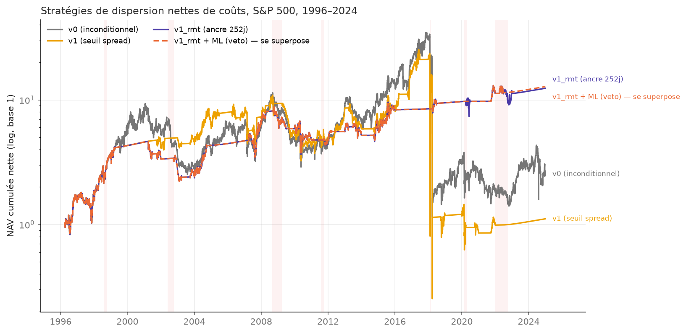

# ML-Driven Dispersion Trading on the S&P 500

**Harvesting the correlation risk premium, 1996–2024** — MSc Financial Engineering
Applied Project, Imperial College Business School (2026).

A systematic dispersion strategy: short the S&P 500 index straddle, long a basket of
constituent straddles, vega-neutral, which is a short position in correlation. The project
replicates Driessen, Maenhout & Vilkov (2009) on 29 years of WRDS data, then tests two
modern layers on top — **Random Matrix Theory** cleaning of the correlation matrix and a
**machine-learning timing signal** — under a pre-registered, purged walk-forward protocol.

The results are reported honestly, nulls included. That is the point of the project.

### 📄 [Read the full report (PDF)](docs/Dispersion_Trading_Report.pdf)

> **Going deeper:** every design decision, with the underlying mathematics, the data-QA
> log and the week-by-week research log, lives in [METHODOLOGY.md](METHODOLOGY.md).
> The pre-registered ML protocol (fixed before any result was computed) is in
> [plan.md](plan.md). The original project-proposal deck is in
> [docs/2026_Project_Pitch.pdf](docs/2026_Project_Pitch.pdf).

## Results

| Strategy | Net Sharpe | Net skew | Net max drawdown | Gross Sharpe |
|---|---|---|---|---|
| v0 — unconditional dispersion trade | 0.42 | −1.33 | −99.0% | 0.77 |
| v1_rmt — gated on the RMT-cleaned signal | 0.56 | +0.80 | −58.5% | 0.80 |
| **v1_rmt + regime — recommended** | **0.57** | **+1.00** | **−52.4%** | **0.78** |

*115 quarters, 1996–2024, net of a cost grid calibrated on real quoted spreads.*



### Five findings

1. **The correlation risk premium is real.** Implied correlation exceeded subsequently
   realised correlation by **+0.079** on average (Newey–West t = 7.4, positive on 75% of
   7,221 days) — but it **compressed to a statistically insignificant +0.028 after 2020**,
   exactly what a limits-to-arbitrage account predicts as option spreads fell.
2. **The baseline replicates DMV, and frictions nearly kill it.** Gross Sharpe 0.77
   against their 0.73; net of costs 0.42 against their 0.41. The tail is the real problem:
   one quarter (Q1-2018, "Volmageddon") loses 91% on its own, through the delta-hedge
   bleed, not the option legs.
3. **RMT helps — but not where the textbooks say.** Gating on the cleaned 252-day signal
   transforms the tail (skew −1.33 → +0.80, drawdown −99% → −58.5%). An ablation is
   decisive: the raw un-clipped 252-day window does essentially the same (2/115 gate
   disagreements). **The value is the slow estimation window, not the eigenvalue
   clipping.**
4. **The supervised ML timing layer is a clean null.** Out of sample, the meta-model
   cannot predict the trade's quarterly return (corr(ŷ, y): VIX-only +0.02, VIX+spectral
   −0.14, full −0.20), and spectral features do not beat the VIX. A follow-up experiment
   sharpens the finding: the daily correlation *spike* **is** predictable (corr +0.40),
   yet vetoing on it still lowers the Sharpe — **the danger is priced**. Detecting stress
   is not predicting the loss.
5. **What survives is deliberately simple.** An unsupervised regime veto (GMM/HMM,
   causal filtered probabilities) trims the tail at no Sharpe cost, and trading only the
   top-20 names beats the full 100-name basket **net** of costs (Sharpe 0.60 vs 0.57) by
   avoiding small-cap spreads — the friction-aware answer.

## Method in brief

**Data.** WRDS: OptionMetrics IvyDB US standardised surface (91-day, ±50Δ ATM vols and
`impl_premium` entry prices) and CRSP (total returns, point-in-time `dsp500list`
membership, zero curve). Identifiers linked through the official bridge, exact matches
only. Raw data is never committed (WRDS licensing).

**Universe.** Point-in-time top-100 S&P 500 by market cap, renormalised weights, 116
quarterly rebalances, 1996–2024. N = 100 covers 63–70% of index cap and gives the RMT
layer a well-populated 100-eigenvalue spectrum.

**Signal.** One-factor implied correlation from the index-variance identity, fed with ATM
implied vols; realised correlation from a complete-case (PSD) matrix collapsed with
formula-consistent weights. Two window-matched objects: an ex-post premium (validation
only) and an ex-ante tradeable signal — the forward series is never a trading input.

**Backtest engine.** DMV conventions throughout: vega-neutral to proportional vol shocks,
−100% of wealth in the index straddle, daily index-only delta hedge, daily
mark-to-surface (linear in total variance), intrinsic settlement at the next rebalance.
Costs: half the quoted bid–ask spread per entry leg, calibrated on real `opprcd` quotes
per era and per cap bucket — conservative by construction, stress-tested at ±50%.

**RMT.** Marchenko–Pastur with the Laloux effective edge on 252-day de-volatilised
windows; bulk eigenvalues clipped preserving the trace. The 63-day matrix (q = N/T ≈ 1.6)
is singular by construction and used only for the window-matched scalar.

**ML.** Meta-labelling veto (XGBoost) over the gated strategy; features in three nested
sets (VIX family / + RMT spectral / + signal-level) — the central test of the project.
Unsupervised GMM + Gaussian HMM regime detector restricted to filtered, forward-only
probabilities. Validation: purged walk-forward, 63-day purge, 21-day embargo. The whole
protocol (features, label, grids, the 0.42 net-Sharpe bar) was **pre-registered before
any result was computed**.

<details>
<summary><b>Design choices worth a closer look</b></summary>

- **ATM vols, not MFIV, for implied correlation** — instrument-consistent (the book
  trades ATM straddles) and conservative: rebuilding the index-leg MFIV from the full
  smile shows the ATM proxy *understates* implied correlation by +0.066 on average, on
  100% of rebalances. The headline premium is a lower bound.
- **Vega convention pinned down.** DMV's neutrality is to *proportional* vol shocks
  (straddle relative vega ≈ 1/σ) — the only convention that reproduces their +101.12%
  component leg. Ours lands at +99.5%.
- **Q1-2018 dissected via the daily ledger.** Both option legs of the quarter ended
  positive; the −91% came through the gamma/delta-hedge channel as realised correlation
  spiked — the loss mechanism of the trade, not a marking artefact.
- **Listwise correlation, not pairwise** — keeps the matrix positive semi-definite, which
  the RMT layer requires.
- **Regime detector causality audited.** Filtered (forward-only) HMM probabilities,
  walk-forward fits, danger labelling from training windows only; three dedicated
  causality tests in the suite.
</details>

## Repository structure

```
main.py                     end-to-end pipeline: WRDS → parquets → signals/RMT/ML → backtests
src/dispersion/
  data/                     WRDS access, universe, IV, returns, spots, dataset assembly
  signal/                   implied correlation, premium & tradeable signal
  backtest/                 daily mark-to-surface + the dispersion engine
  rmt/                      Marchenko–Pastur + Laloux cleaning, daily spectral series
  ml/                       features, GMM/HMM regime detector, meta-model, experiments
  utils/                    Black–Scholes / Black-76 greeks, relative conversions
tests/                      pytest suite — 39 tests (greeks, marking, engine, RMT, HMM causality)
exploration_notebooks/      01–11, pipeline order; validated logic promoted into src/
results/                    every figure and table behind the numbers above
data/                       raw + processed parquets (git-ignored, WRDS-licensed)
```

## Reproducing

Requires a WRDS account with CRSP + OptionMetrics access, and
[uv](https://docs.astral.sh/uv/).

```bash
uv sync                                          # Python 3.12 + locked dependencies
cp .env.example .env                             # set WRDS_USERNAME and PYTHONPATH=src
uv run --env-file .env python main.py            # full run: WRDS pull → backtests
uv run --env-file .env python main.py --no-data  # reuse the base parquets
uv run pytest                                    # 39/39
```

Figures and tables are written to `results/` under the exact filenames referenced above.

## Honest limitations

Full-cap (not float-adjusted) weights; ATM proxy for implied vol (quantified as
conservative); costs are a calibrated parametric grid on quoted spreads, not per-trade
quotes; positions held to maturity, no intra-quarter unwind; the ML null is low-powered
(~90 quarterly predictions, ~12 crises); a 17-day OptionMetrics vendor gap (Aug 2020) is
accepted as missing rather than repaired.

## References

- Bakshi, G. & Kapadia, N. (2003) Delta-hedged gains and the negative market volatility
  risk premium. *The Review of Financial Studies*. 16 (2), 527–566.
- Bakshi, G., Kapadia, N. & Madan, D. (2003) Stock return characteristics, skew laws, and
  the differential pricing of individual equity options. *The Review of Financial
  Studies*. 16 (1), 101–143.
- Bun, J., Bouchaud, J.-P. & Potters, M. (2017) Cleaning large correlation matrices:
  tools from random matrix theory. *Physics Reports*. 666, 1–109.
- Carr, P. & Madan, D. (1998) Towards a theory of volatility trading. In: Jarrow, R.
  (ed.) *Volatility: new estimation techniques for pricing derivatives*. London, Risk
  Books. pp. 417–427.
- Center for Research in Security Prices (CRSP). (2025) *CRSP US stock and index
  databases*. Accessed via Wharton Research Data Services.
- Driessen, J., Maenhout, P. J. & Vilkov, G. (2009) The price of correlation risk:
  evidence from equity options. *The Journal of Finance*. 64 (3), 1377–1406.
- Kritzman, M. & Li, Y. (2010) Skulls, financial turbulence, and risk management.
  *Financial Analysts Journal*. 66 (5), 30–41.
- Kritzman, M., Li, Y., Page, S. & Rigobon, R. (2011) Principal components as a measure
  of systemic risk. *The Journal of Portfolio Management*. 37 (4), 112–126.
- Laloux, L., Cizeau, P., Bouchaud, J.-P. & Potters, M. (1999) Noise dressing of
  financial correlation matrices. *Physical Review Letters*. 83 (7), 1467–1470.
- López de Prado, M. (2018) *Advances in financial machine learning*. Hoboken, NJ, John
  Wiley & Sons.
- Marchenko, V. A. & Pastur, L. A. (1967) Distribution of eigenvalues for some sets of
  random matrices. *Mathematics of the USSR-Sbornik*. 1 (4), 457–483.
- OptionMetrics. (2025) *IvyDB US options database*. Accessed via Wharton Research Data
  Services.
- Potters, M. & Bouchaud, J.-P. (2020) *A first course in random matrix theory: for
  physicists, engineers and data scientists*. Cambridge, Cambridge University Press.
- Rabiner, L. R. (1989) A tutorial on hidden Markov models and selected applications in
  speech recognition. *Proceedings of the IEEE*. 77 (2), 257–286.

## License

Code released under the [MIT License](LICENSE). The WRDS data (OptionMetrics, CRSP) is
not included and remains subject to its own licence.

---

*Nathan Sebbag — MSc Risk Management & Financial Engineering, Imperial College London.*
